# MoreFind
 [](https://goreportcard.com/report/github.com/mstxq17/MoreFind)  

一款用于快速导出URL、Domain和IP的**魔法**小工具


##  欢迎使用

本工具开发崇尚第一原则： 小、简、美  

如果有简单的需求可以提交ISSUE，不支持复杂需求，目前该工具已经能满足作者工作常用的大部分操作。

## 快速安装

方式一: 通过Go包管理安装
```bash
go install  github.com/mstxq17/MoreFind@latest
```
方式二: 直接安装二进制文件
```bash
wget --no-check-certificate  https://ghproxy.com/https://github.com/mstxq17/MoreFind/releases/download/v1.4.3/MoreFind_`uname -s`_`uname -m`.tar.gz
tar -xzvf MoreFind_`uname -s`_`uname -m`.tar.gz
sudo mv ./MoreFind /usr/bin/MoreFind && chmod +x /usr/bin/MoreFind
```

方式三: 本地编译
```bash
git clone https://github.com/mstxq17/MoreFind.git
chmod +x ./build.sh && ./build.sh
```

方式四：Release 页面已经发布各大系统的二进制执行文件直接下载执行

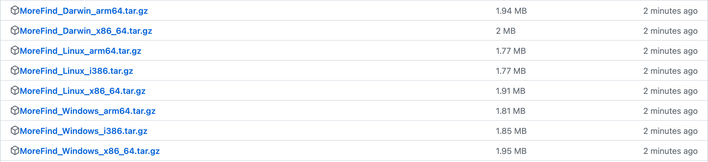


## 用法说明

显示帮助信息
```bash
MoreFind -h
```
```bash
MoreFind is a very fast script for searching URL、Domain and Ip from specified stream

Usage:
  morefind [flags]
  morefind [command]

Available Commands:
  completion  Generate the autocompletion script for the specified shell
  help        Help about any command
  version     Print the semantic version number of MoreFind

Flags:
  -f, --file string                                              search the info in specified file(指定输入文件)
  -o, --output string                                            output the result to specified file(指定输出文件)
  -i, --ip                                                       search ip from stdin or file(搜索IP)
      --exclude                                                  exclude internal/private segment of ip when searching ip(排除内网IP)
  -d, --domain                                                   search domain from stdin or file(搜索域名)
      --root                                                     only output the rootDomain when searching domain(只显示主域名)
  -p, --port                                                     only filter out domain&ip:port (保留域名&ip和端口)
  -r, --rule string                                              replacement rule (替换规则 https://{}/)
      --flag string                                              replacement identification (替换标志位) (default "{}")
  -u, --url                                                      search url from stdin or file(搜索URL)
      --filter string[="js,css,json,png,jpg,html,xml,zip,rar"]   filter url with some useless ext(排除指定后缀的URL)
  -c, --cidr string[="__pipe__"]                                 output the specified cidr ip list (输出指定CIDR范围内的所有IP)
  -l, --len string                                               search specify the length of string, "-l 35" == "-l 0-35" (输出指定长度的行)
  -s, --show                                                     show the length of each line and summaries(输出统计信息)
  -h, --help                                                     help for morefind

Use "morefind [command] --help" for more information about a command.

```


1)导出URL

```bash
MoreFind -u
# append --filter(default:js,css,json,png,jpg,html,xml,zip,rar) or --filter="png,jpg,xls,custom..."
# 通过添加参数 --filter(默认排除常见静态文件) 或者 通过 --filter="png,jpg" 自定义需要排除的后缀
MoreFind  -u --filter="png"
```


2)导出域名

```bash
MoreFind -d
# append -root param can only search rootdomain
# 通过加上 --root 参数能够只显示根域名
MoreFind -d --root
# append --port param can retain domain:port format
# 通过加上 --port 参数保留域名:端口的格式，搭配grep
MoreFind -d --root --port
```


3)导出ip

```bash
# 默认会搜索全部ipv4地址
MoreFind -i
# 加上--exclude 排除属于内网的ip, 存在bug，比如localhost, 127.0.0.1 这些回环ip没排除
MoreFind -i --exclude
# 加上 --port 参数保留ip:端口的格式
MoreFind -i --exclude --port 
```


4)输出统计信息

```bash
MoreFind -s
```


5)筛选指定长度字符串

```bash
MoreFind -l 35 
MoreFind -l 0-35
```


6)解析CIDR生成指定ip列表

```bash
MoreFind -c="192.168.0.1/24"
MoreFind -c="192.168.0.1-192.168.2.254"
echo -e "192.168.4.1/24\n192.168.1.1/24"|./MoreFind --cidr
```


7)支持自定义输出规则

```bash
# 最终会将结果替换到 {} 
MoreFind -i --exclude -r "http://{}/"  
```


*)支持导出结果

```bash
MoreFind -u -d -i -o result.txt
```


*)联动使用

```bash
echo -e 'baidu.com ccccxxxx 1.com'|MoreFind -d |MoreFind -l 5  
```


## 使用场景

假设当前你有这样一个文本文件

```
baidu.com 127.0.0.2 baidu.com http://baidu.com:9090 http://www.baidu.com:9091
http://baidu.com/hi.jpg?a=1
http://baidu.com/xxx/hi.jpg  http://111.230.198.123:9090 http:/111.230.198.123:9091/
kk.baidu.com
http://x.kk.baidu.com/1.png
http://123.0.0.1/kkk/%2311  safafs
127.0.0.1/kkkk
111.230.198.123/2222/hellophp
111.230.198.123/2222/hello.php
192.168.1.1
```

如果你想提取里面的URL

```bash
# linux/osx
cat 1.txt|MoreFind           
# window
type 1.txt|MoreFind
# 通用
MoreFind -f 1.txt
```

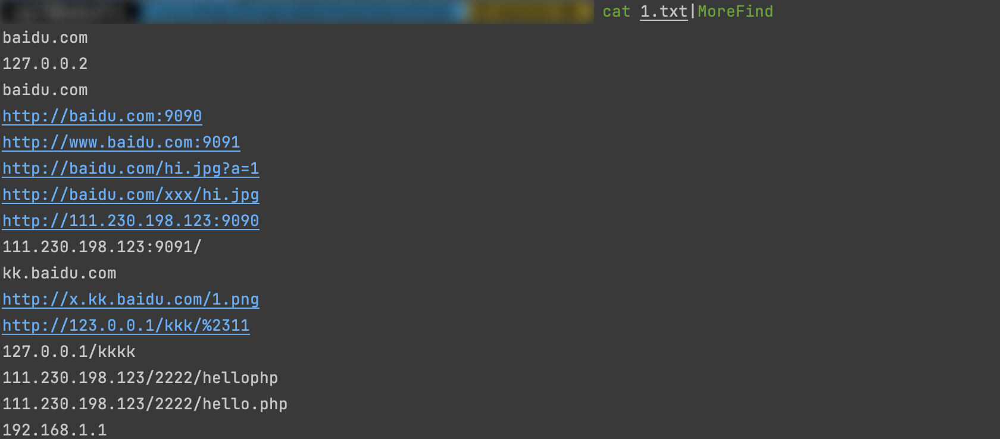

如果你只想提取域名，MoreFind 会自动去重，如果你想提取根域名

```bash
cat 1.txt|MoreFind -d
cat 1.txt|MoreFind -d --root
```

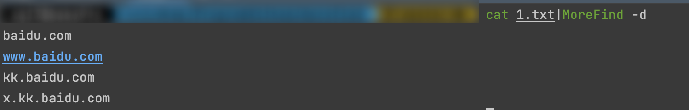

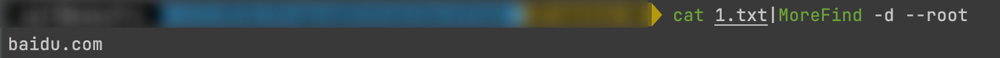

同理，ip也是可以这样的,有时候不想要内网域名

```bash
cat 1.txt|MoreFind -i
cat 1.txt|MoreFind -i --exclude
```

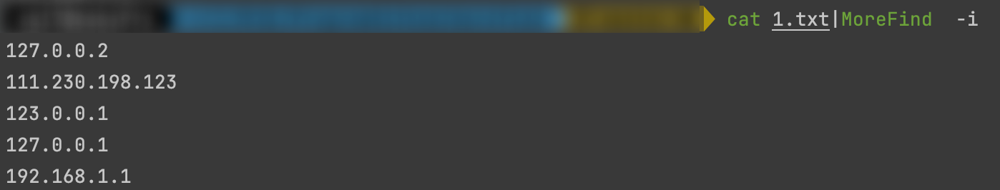

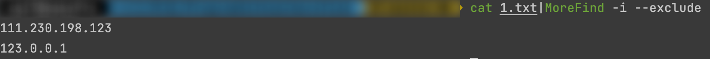

可能你还想提取带端口的ip和域名

```bash
MoreFind  -f 1.txt -d --port
MoreFind  -f 1.txt -i --port
MoreFind  -f 1.txt -d -i --port
```

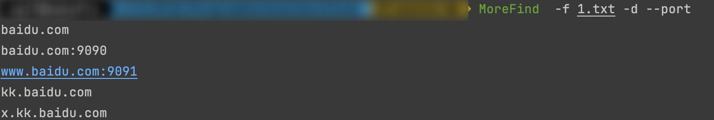

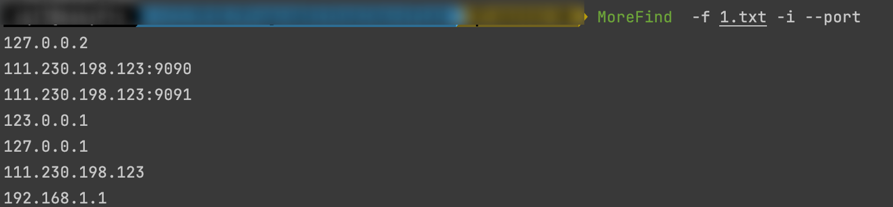

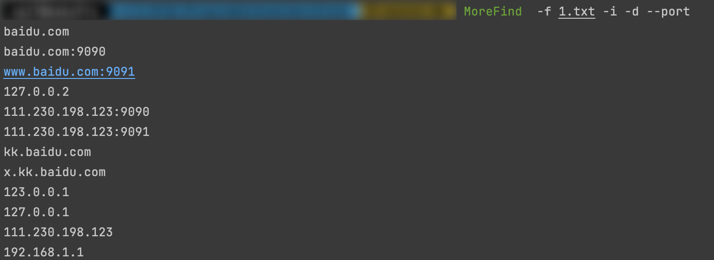

你可能想扫描https或者构造一些特殊URL，MoreFind也可以帮你实现

```bash
cat 1.txt|MoreFind -d --port -r "https://{}/"
cat 1.txt|MoreFind -d --port -r "https://$/" --flag '$'
cat 1.txt|MoreFind -d --port -r "https://redacted.com/{}/?url={}"
```

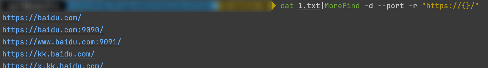

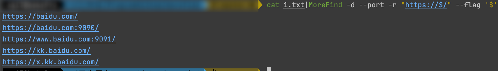

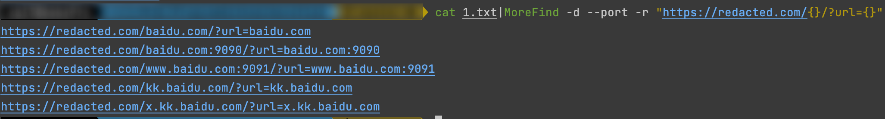


## 性能方面 

二进制文件大小约6.4M，

在i7 2.8ghz 环境跑完 646423W 条数据所需的时间为51s, 在性能上存在非常多的成长空间，TODO见。

```bash
time MoreFind -f ok_domain.txt
```

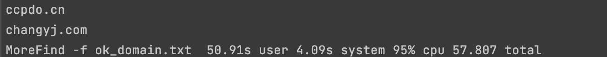

**Warning**

> 虽然MoreFind 完全满足日常工作使用，但其不适合处理单行过长的文件，后面可能考虑优化，但是这种场景应该有更好的解决方案，我个人不是很愿意集成到MoreFind，不过还是放TODOS。

## TODO

- [x] 输出结果自动去重复
- [x] 搜索ip的时候支持排除私有IP地址
- [x] 搜索URL的时候支持排除自定义后缀的URL
- [x] 增加返回结果形式，支持过滤数据返回`域名:port`的格式
- [x] 增加返回结果形式，支持过滤数据返回`ip:port`的格式
- [x] 支持搜索域名的时候根据etld+1的形式只显示根域名
- [x] 读取文件流，输出统计信息，显示每行长度
- [x] 可指定每行长度筛选出符合条件的字符串
- [x] 增加命令行中文版本，防止自己的蹩脚英语影响使用
- [x] 支持生成解析CIDR从而生成指定ip列表
- [x] 支持自定义输出规则，如原输出123 -> http://{}/ -> 转换输出-> http://123/
- [x] 排除内网IP功能，增加支持对回环本地IP进行过滤
- [x] 完善Log的输出和处理(* 继续需要改进)
- [ ] 增强cidr生成IP列表功能，支持输出ip的多种格式
- [ ] 支持命令行控制显示中文/英文的帮助提示
- [ ] 重新设计代码结构，并完善脚本异常处理部分
- [ ] 加入部分URL智能去重代码
- [ ] 实现自动强制更新，每次运行执行检查
- [ ] 支持优化读取单行超大文本
- [ ] 优化项目代码和提高程序执行速度!!! >>>>>>>>>>>>>>>>>>>>