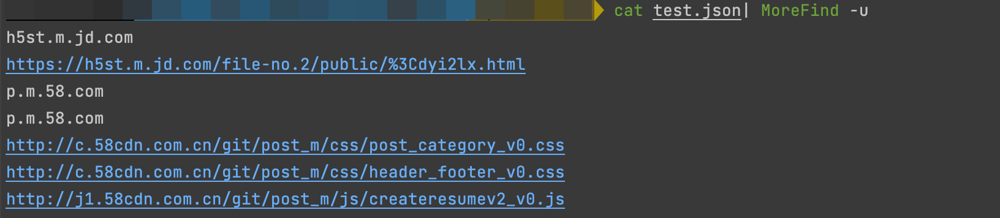
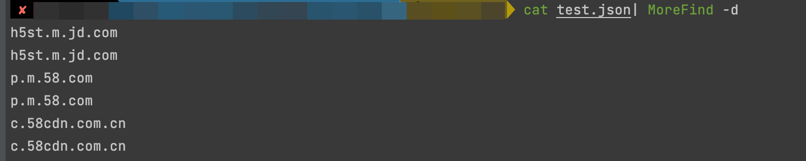
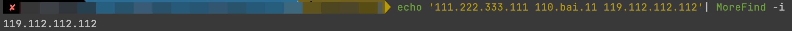

# MoreFind
一款用于快速导出URL、Domain和IP的小工具


## 快速安装
方式一: 通过Go包管理安装
```bash
go install  github.com/mstxq17/MoreFind@latest
```
方式二: 直接安装二进制文件
```bash
wget --no-check-certificate  https://ghproxy.com/https://github.com/mstxq17/MoreFind/releases/download/v1.2.4/MoreFind_1.2.4_`uname -s`_`uname -m`.tar.gz
tar -xzvf MoreFind_1.2.4_`uname -s`_`uname -m`.tar.gz
sudo mv ./MoreFind /usr/bin/MoreFind && chmod +x /usr/bin/MoreFind
```

方式三: 本地编译
```bash
git clone https://github.com/mstxq17/MoreFind.git
chmod +x ./build.sh && ./build.sh
```

## 用法说明
1)帮助信息
```bash
MoreFind -h
```
```bash
MoreFind is a very fast script for searching URL、Domain and Ip from specified stream

Usage:
  morefind [flags]
  morefind [command]

Available Commands:
  completion  Generate the autocompletion script for the specified shell
  help        Help about any command
  version     Print the semantic version number of MoreFind

Flags:
  -d, --domain                                                   search domain from stdin or file(搜索域名)
      --exclude                                                  exclude internal/private segment of ip when searching ip(排除内网IP)
  -f, --file string                                              search the info in specified file(指定输入文件)
      --filter string[="js,css,json,png,jpg,html,xml,zip,rar"]   filter url with some useless ext(排除指定后缀的URL)
  -h, --help                                                     help for morefind
  -i, --ip                                                       search ip from stdin or file(搜索IP)
  -l, --len string                                               search specify the length of string, "-l 35" == "-l 0-35" (输出指定长度的行)
  -o, --output string                                            output the result to specified file(指定输出文件)
      --root                                                     only output the rootDomain when searching domain(只显示主域名)
  -s, --show                                                     show the length of each line and summaries(输出统计信息)
  -u, --url                                                      search url from stdin or file(搜索URL)

Use "morefind [command] --help" for more information about a command.


```


2)导出URL

```bash
MoreFind -u
# append --filter(default:js,css,json,png,jpg,html,xml,zip,rar) or --filter="png,jpg,xls,custom..."
# 通过添加参数 --filter(默认排除常见静态文件) 或者 通过 --filter="png,jpg" 自定义需要排除的后缀
MoreFind  -u --filter="png"
```




3)导出域名

```bash
MoreFind -d
# append -root or -r param can only search rootdomain
# 通过加上 -root 或 -r 参数能够只显示根域名
MoreFind -d -root
```




4)导出ip

```bash
# 默认会搜索全部ipv4地址
MoreFind -i
# 加上--exclude 或者 -e 会排除属于内网的ip
MoreFind -i -e
```



5)输出统计信息

```bash
MoreFind -s
```

6)筛选指定长度字符串

```bash
MoreFind -l 35 
MoreFind -l 0-35
```

7)支持导出结果

```bash
MoreFind -u -d -i -o result.txt
```


8)联动使用

```bash
echo -e 'baidu.com ccccxxxx 1.com'|MoreFind -d |MoreFind -l 5  
```


## TODO

- [x] 输出结果自动去重复

- [x] 搜索ip的时候支持排除私有IP地址

- [x] 搜索URL的时候支持排除自定义后缀的URL

- [x] 支持搜索域名的时候根据etld+1的形式只显示根域名

- [x] 读取文件流，输出统计信息，显示每行长度

- [x] 可指定每行长度筛选出符合条件的字符串

- [x] 增加命令行中文版本，防止自己的蹩脚英语影响使用

- [ ] 重新设计代码结构，并完善脚本异常处理部分

- [ ] 加入部分URL智能去重代码

- [ ] 完善Log的输出和处理

- [ ] 实现自动强制更新

- [ ] 优化项目代码和提高执行速度