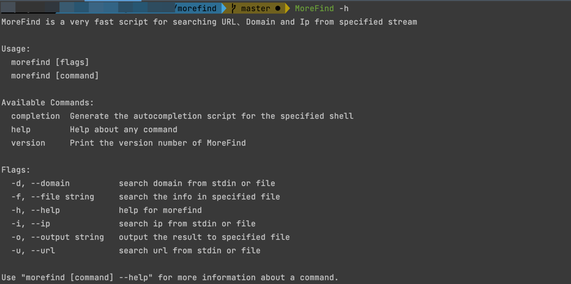

# MoreFind
一款用于快速导出URL、Domain和IP的小工具


## 快速安装
方式一: 通过Go包管理安装
```bash
go get github.com/mstxq17/MoreFind
```
方式二: 直接安装二进制文件

方式三: 本地编译


## 用法说明
1)帮助信息
```bash
MoreFind -h
```


2)导出URL
```bash
MoreFind -u
```

3)导出域名
```bash
MoreFind -d
```

4)导出ip
```bash
MoreFind -i
```


## TODO
1)优化代码逻辑和结构

2)输出结果自动去重复

3)完善脚本异常处理部分

4)加入部分URL智能去重代码