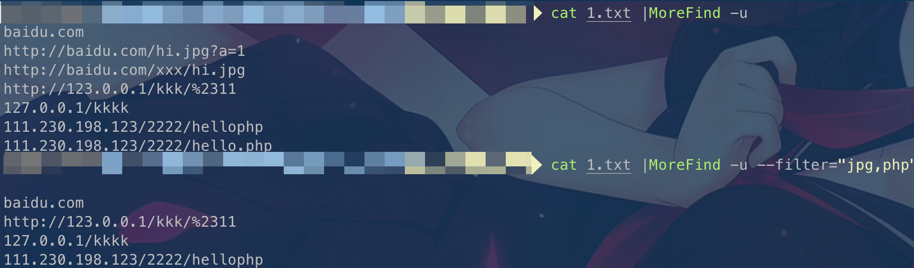
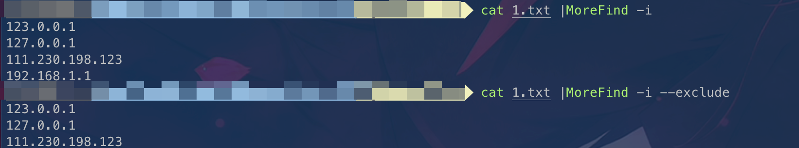
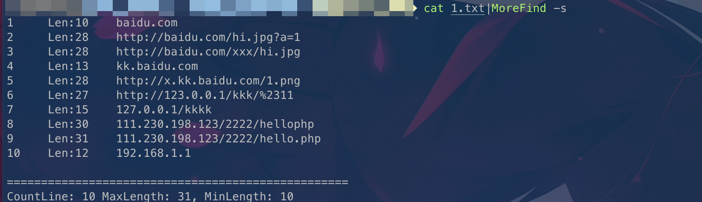
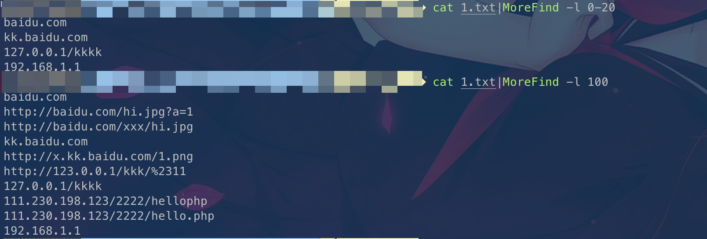

# MoreFind
 [](https://goreportcard.com/report/github.com/mstxq17/MoreFind)  

一款用于快速导出URL、Domain和IP的小工具


## 快速安装
方式一: 通过Go包管理安装
```bash
go install  github.com/mstxq17/MoreFind@latest
```
方式二: 直接安装二进制文件
```bash
wget --no-check-certificate  https://ghproxy.com/https://github.com/mstxq17/MoreFind/releases/download/v1.2.7/MoreFind_1.2.7_`uname -s`_`uname -m`.tar.gz
tar -xzvf MoreFind_1.2.7_`uname -s`_`uname -m`.tar.gz
sudo mv ./MoreFind /usr/bin/MoreFind && chmod +x /usr/bin/MoreFind
```

方式三: 本地编译
```bash
git clone https://github.com/mstxq17/MoreFind.git
chmod +x ./build.sh && ./build.sh
```

## 用法说明
显示帮助信息
```bash
MoreFind -h
```
```bash
MoreFind is a very fast script for searching URL、Domain and Ip from specified stream

Usage:
  morefind [flags]
  morefind [command]

Available Commands:
  completion  Generate the autocompletion script for the specified shell
  help        Help about any command
  version     Print the semantic version number of MoreFind

Flags:
  -d, --domain                                                   search domain from stdin or file(搜索域名)
      --exclude                                                  exclude internal/private segment of ip when searching ip(排除内网IP)
  -f, --file string                                              search the info in specified file(指定输入文件)
      --filter string[="js,css,json,png,jpg,html,xml,zip,rar"]   filter url with some useless ext(排除指定后缀的URL)
  -h, --help                                                     help for morefind
  -i, --ip                                                       search ip from stdin or file(搜索IP)
  -l, --len string                                               search specify the length of string, "-l 35" == "-l 0-35" (输出指定长度的行)
  -o, --output string                                            output the result to specified file(指定输出文件)
      --root                                                     only output the rootDomain when searching domain(只显示主域名)
  -s, --show                                                     show the length of each line and summaries(输出统计信息)
  -u, --url                                                      search url from stdin or file(搜索URL)

Use "morefind [command] --help" for more information about a command.


```

----

下面以文件内容如下的`1.txt`文件说明该工具的用法

```
baidu.com
http://baidu.com/hi.jpg?a=1
http://baidu.com/xxx/hi.jpg
kk.baidu.com
http://x.kk.baidu.com/1.png
http://123.0.0.1/kkk/%2311
127.0.0.1/kkkk
111.230.198.123/2222/hellophp
111.230.198.123/2222/hello.php
192.168.1.1
```

1)导出URL

```bash
MoreFind -u
# append --filter(default:js,css,json,png,jpg,html,xml,zip,rar) or --filter="png,jpg,xls,custom..."
# 通过添加参数 --filter(默认排除常见静态文件) 或者 通过 --filter="png,jpg" 自定义需要排除的后缀
MoreFind  -u --filter="png"
```



2)导出域名

```bash
MoreFind -d
# append -root or -r param can only search rootdomain
# 通过加上 --root 或 -r 参数能够只显示根域名
MoreFind -d --root
```


3)导出ip

```bash
# 默认会搜索全部ipv4地址
MoreFind -i
# 加上--exclude 排除属于内网的ip, 存在bug，比如localhost, 127.0.0.1 这些回环ip没排除
MoreFind -i --exclude
```



4)输出统计信息

```bash
MoreFind -s
```



5)筛选指定长度字符串

```bash
MoreFind -l 35 
MoreFind -l 0-35
```



6)支持导出结果

```bash
MoreFind -u -d -i -o result.txt
```

7)联动使用

```bash
echo -e 'baidu.com ccccxxxx 1.com'|MoreFind -d |MoreFind -l 5  
```


## TODO

- [x] 输出结果自动去重复
- [x] 搜索ip的时候支持排除私有IP地址
- [x] 搜索URL的时候支持排除自定义后缀的URL
- [x] 支持搜索域名的时候根据etld+1的形式只显示根域名
- [x] 读取文件流，输出统计信息，显示每行长度
- [x] 可指定每行长度筛选出符合条件的字符串
- [x] 增加命令行中文版本，防止自己的蹩脚英语影响使用
- [ ] 支持命令行控制显示中文/英文的帮助提示
- [ ] 排除内网IP功能，增加支持对回环本地IP进行过滤
- [ ] 重新设计代码结构，并完善脚本异常处理部分
- [ ] 加入部分URL智能去重代码
- [ ] 完善Log的输出和处理
- [ ] 实现自动强制更新
- [ ] 优化项目代码和提高执行速度