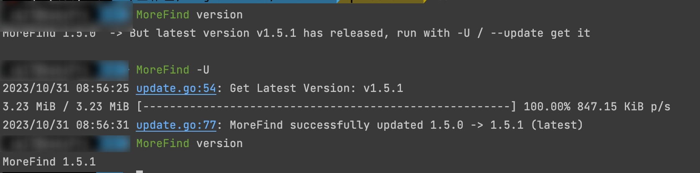

# MoreFind
 [](https://goreportcard.com/report/github.com/mstxq17/MoreFind)  

一款用于快速导出URL、Domain和IP的**魔法**小工具


##  欢迎使用 :zap: 

本工具开发崇尚第一原则： 小、简、美  

如果有简单的需求可以提交ISSUE，不支持复杂需求，目前该工具已经能满足作者工作常用的大部分操作。

## 快速安装 :zap: 

方式一: 通过Go包管理安装
```bash
go install  github.com/mstxq17/MoreFind@latest
```
方式二: 直接安装二进制文件
```bash
wget --no-check-certificate  https://ghproxy.com/https://github.com/mstxq17/MoreFind/releases/download/v1.5.6/MoreFind_v1.5.5_`uname -s`_`uname -m`.tar.gz
tar -xzvf MoreFind_v1.5.5_`uname -s`_`uname -m`.tar.gz
sudo mv ./MoreFind /usr/bin/MoreFind && chmod +x /usr/bin/MoreFind
```

方式三: 本地编译
```bash
git clone https://github.com/mstxq17/MoreFind.git
chmod +x ./build.sh && ./build.sh
```

方式四：Release 页面已经发布各大系统的二进制执行文件直接下载执行


## 用法说明 **:fire:**

显示帮助信息
```bash
MoreFind -h
```
```bash
MoreFind is a very rapid script for extracting URL、Domain and Ip from data stream

Usage:
  morefind [flags]
  morefind [command]

Available Commands:
  completion  Generate the autocompletion script for the specified shell
  dedu        De-duplicated lines
  diff        File Comparator between two files
  grep        If no grep , use this
  help        Help about any command
  version     Print the semantic version number of MoreFind

Flags:
  -f, --file string                                              Specifies the input file path.
  -o, --output string                                            Specifies the output file path.
  -i, --ip                                                       Matches IPs from the input pipe or file.
      --exclude                                                  Excludes internal/private IP segments when using -i/--ip.
  -d, --domain                                                   Matches domains from the input pipe or file.
      --root                                                     Outputs only the primary domain when using -d/--domain.
  -p, --port                                                     Filters only domain & IP:port combinations.
  -r, --rule string                                              Utilizes a custom replacement rule (custom output replacement rule: https://{}/).
      --flag string                                              Specifies the replacement identification. (default "{}")
  -u, --url                                                      Matches URLs from the input pipe or file.
      --filter string[="js,css,json,png,jpg,html,xml,zip,rar"]   Filters URLs with specific extensions.
  -c, --cidr string[="__pipe__"]                                 Outputs the specified CIDR IP list.
  -a, --alter strings                                            IP Alters (0,1,2,3,4,5,6,7,8)
  -l, --len string                                               Matches input specified length string, e.g., "-l 35" == "-l 0-35".
  -s, --show                                                     Displays the length of each line and provides summaries.
  -m, --metric                                                   Outputs execution progress metrics.
  -U, --update                                                   Updates the tool engine to the latest released version.
  -h, --help                                                     help for morefind

Use "morefind [command] --help" for more information about a command.

```

1)导出URL

```bash
MoreFind -u
# append --filter(default:js,css,json,png,jpg,html,xml,zip,rar) or --filter="png,jpg,xls,custom..."
# 通过添加参数 --filter(默认排除常见静态文件) 或者 通过 --filter="png,jpg" 自定义需要排除的后缀
MoreFind  -u --filter="png"
```


2)导出域名

```bash
MoreFind -d
# append -root param can only search rootdomain
# 通过加上 --root 参数能够只显示根域名
MoreFind -d --root
# append --port param can retain domain:port format
# 通过加上 --port 参数保留域名:端口的格式，搭配grep
MoreFind -d --root --port
```


3)导出ip

```bash
# 默认会搜索全部ipv4地址
MoreFind -i
# 加上--exclude 排除属于内网的ip, 存在bug，比如localhost, 127.0.0.1 这些回环ip没排除
MoreFind -i --exclude
# 加上 --port 参数保留ip:端口的格式
MoreFind -i --exclude --port 
```


4)输出统计信息

```bash
MoreFind -s
```


5)筛选指定长度字符串

```bash
MoreFind -l 35 
MoreFind -l 0-35
```


6)解析CIDR生成指定ip列表

```bash
MoreFind -c="192.168.0.1/24"
MoreFind -c="192.168.0.1-192.168.2.254"
echo -e "192.168.4.1/24\n192.168.1.1/24"|./MoreFind --cidr
```


7) 支持输出IP的8种格式

```bash
MoreFind --cidr="127.0.0.1/32" -a 1
MoreFind --cidr="127.0.0.1/32" -a 2
MoreFind --cidr="127.0.0.1/32" -a 1 -a 2
MoreFind --cidr="127.0.0.1/32" --alter 3
...
```

| Format                     | Index | Example                            |
| -------------------------- | ----- | ---------------------------------- |
| Dotted decimal             | 1     | `127.0.0.1`                        |
| 0 Optimized dotted decimal | 2     | `127.1`                            |
| Octal                      | 3     | `0177.0.0.01`                      |
| Hexadecimal                | 4     | `0x7f.0x0.0x0.0x1`                 |
| Decimal (Dword)            | 5     | `2130706433`                       |
| Binary                     | 6     | `01111111000000000000000000000001` |
| Mixed                      | 7     | `127.0x1`                          |
| URL encoded                | 9     | `%31%32%37%2E%30%2E%30%2E%31`      |

8)支持自定义输出规则

```bash
# 最终会将结果替换到 {} 
MoreFind -i --exclude -r "http://{}/"  
```

9)支持输出执行进度，读取大文件的时候让你心里有数 (默认不开启)

```bash
MoreFind -f 1.txt -m 
MoreFind -f 1.txt --metric
```


a)支持检测最新版本并自动更新

```bash
MoreFind -U
MoreFind --update
```




*)支持导出结果

```bash
MoreFind -u -d -i -o result.txt
```


*)联动使用

```bash
echo -e 'baidu.com ccccxxxx 1.com'|MoreFind -d |MoreFind -l 5  
```


## 命令增强 **:boom:**

目前新增三个子命令:

> 子命令相当于 MoreFind 独立出来的一个子模块，起到补充增强的作用，目前代码结构存在多种可能性，整体处于灰度测试状态

1） 启发式去重

```bash
MoreFind dedu -h
# 基础去重
cat baidu.txt| MoreFind dedu 
# 智能去重复，去重相似的，目前只有一个规则
cat baidu.txt| MoreFind dedu --smart 
# -t / --theshold 是相似的阈值当超过指定值就不会进行输出
cat baidu.txt| MoreFind dedu --smart -t 20
```


2）diff 比较 / 严格比较两个文件的行，支持输出三种结果: 1）A文件有的，B文件没有的行 2）B有A没有的  3）AB都有的

```bash
MoreFind diff -h
MoreFind diff 1.txt 2.txt -M 1 
MoreFind diff 1.txt 2.txt -M 2
MoreFind diff 1.txt 2.txt -M 3
# 严格按照顺序逐行比较
MoreFind diff 1.txt 2.txt -M 1 --strict
```


3）grep 功能，抛弃window的find，实现 OSX/Linux 才有的正则匹配功能，统一使用

```bash
MoreFind grep -h
# 正则匹配
cat 1.txt|MoreFind grep "baidu.com"    ==  cat 1.txt|MoreFind grep -P "baidu.com"
# 反选
cat 1.txt|MoreFind grep "baidu.com" -v == cat 1.txt|MoreFind grep -P "baidu.com" -v
```


## 使用场景 **:fire:**

假设当前你有这样一个文本文件

```
baidu.com 127.0.0.2 baidu.com http://baidu.com:9090 http://www.baidu.com:9091
http://baidu.com/hi.jpg?a=1
http://baidu.com/xxx/hi.jpg  http://111.230.198.123:9090 http:/111.230.198.123:9091/
kk.baidu.com
http://x.kk.baidu.com/1.png
http://123.0.0.1/kkk/%2311  safafs
127.0.0.1/kkkk
111.230.198.123/2222/hellophp
111.230.198.123/2222/hello.php
192.168.1.1
```

如果你想提取里面的URL

```bash
# linux/osx
cat 1.txt|MoreFind           
# window
type 1.txt|MoreFind
# 通用
MoreFind -f 1.txt
```


如果你只想提取域名，MoreFind 会自动去重，如果你想提取根域名

```bash
cat 1.txt|MoreFind -d
cat 1.txt|MoreFind -d --root
```


同理，ip也是可以这样的,有时候不想要内网域名

```bash
cat 1.txt|MoreFind -i
cat 1.txt|MoreFind -i --exclude
```


可能你还想提取带端口的ip和域名

```bash
MoreFind  -f 1.txt -d --port
MoreFind  -f 1.txt -i --port
MoreFind  -f 1.txt -d -i --port
```


你可能想扫描https或者构造一些特殊URL，MoreFind也可以帮你实现

```bash
cat 1.txt|MoreFind -d --port -r "https://{}/"
cat 1.txt|MoreFind -d --port -r "https://$/" --flag '$'
cat 1.txt|MoreFind -d --port -r "https://redacted.com/{}/?url={}"
```


## 性能方面 :rocket: 

二进制文件大小约6.4M，

在i7 2.8ghz 环境跑完 646423W 条数据所需的时间为51s, 实际上在iterm会更快，不过MoreFind依然在性能上存在非常多的成长空间，TODO见。

```bash
time MoreFind -f ok_domain.txt
```


v1.5.0 版本增加不少功能，体积去到 8164KB，追求更高的压缩比使用`upx -9 MoreFind ` 压缩到 4052 KB。

**Warning**

> 虽然MoreFind 完全满足日常工作使用，但其不适合处理单行过长的文件，后面可能考虑优化，但是这种场景应该有更好的解决方案，我个人不是很愿意集成到MoreFind，不过还是放TODOS。


## TODO 条目 **:white_check_mark:**

- [x] 输出结果自动去重复
- [x] 搜索ip的时候支持排除私有IP地址
- [x] 搜索URL的时候支持排除自定义后缀的URL
- [x] 增加返回结果形式，支持过滤数据返回`域名:port`的格式
- [x] 增加返回结果形式，支持过滤数据返回`ip:port`的格式
- [x] 支持搜索域名的时候根据etld+1的形式只显示根域名
- [x] 读取文件流，输出统计信息，显示每行长度
- [x] 可指定每行长度筛选出符合条件的字符串
- [x] 增加命令行中文版本，防止自己的蹩脚英语影响使用
- [x] 支持生成解析CIDR从而生成指定ip列表
- [x] 支持自定义输出规则，如原输出123 -> http://{}/ -> 转换输出-> http://123/
- [x] 排除内网IP功能，增加支持对回环本地IP进行过滤
- [x] 增加执行状态参数，实时输出程序的执行过程的进度条
- [x] 完善Log的输出和处理(* 继续需要改进)
- [x] 加入部分URL智能去重代码
- [x] 支持优化读取单行超大文本(* 这一块有点问题)
- [x] 支持简单的grep功能: 正则匹配和反选
- [x] 支持比较两个文件的每一行并输出3种结果
- [x] 支持检测最新版本并实现自更新
- [x] 命令帮助信息规范化，目前默认统一为英文
- [x] 增强cidr生成IP列表功能，支持输出ip的多种格式(thanks for mapcidr)
- [x] 统一结果输出, 将 stdout&file 合并到相同逻辑处理
- [ ] 考虑重构程序，增加对ipv6的支持
- [ ] 支持命令行控制显示中文/英文的帮助提示
- [ ] 重新设计代码结构，并完善脚本异常处理部分
- [ ] 优化项目代码和提高程序执行速度!!! >>>>>>>>>>>>>>>>>>>>